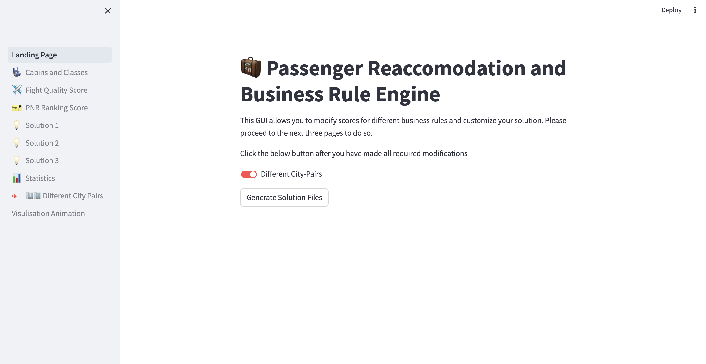
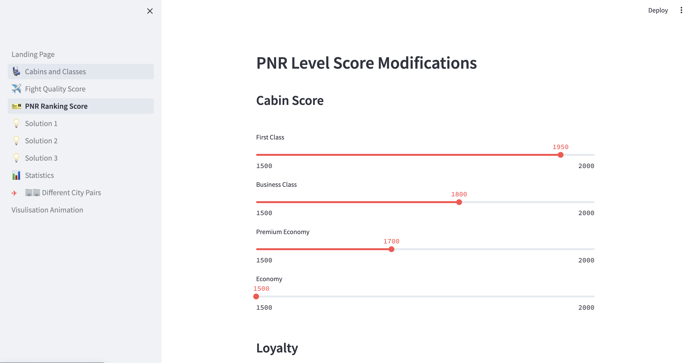
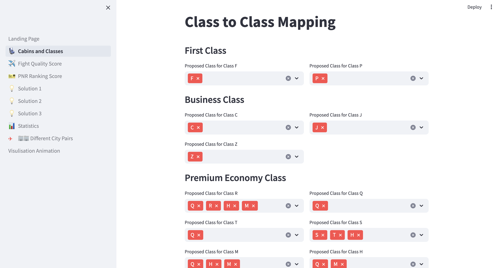
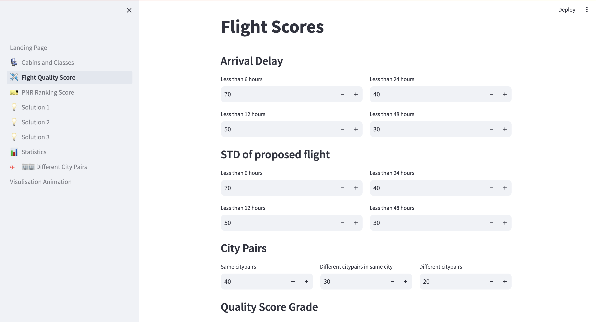
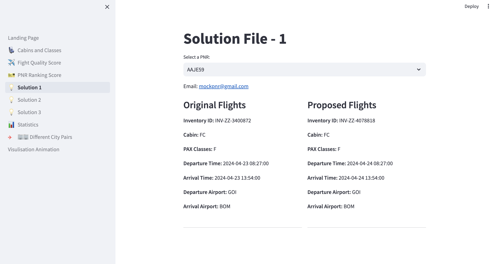
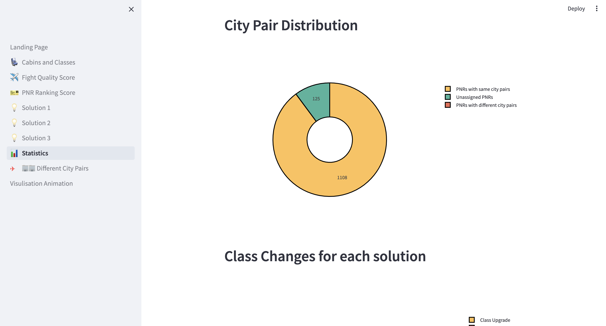

# Passenger-Recovery-Optimization

Airlines routinely change their flight schedules for various reasons like seasonal demands, picking new routes, time changes needed based on daylight savings, changes to flight numbers,
operating frequency, timings, etc. Many passengers get impacted due to these schedule
changes and they need to be regularly re-accommodated to alternate flights. 

The project uses a advanced and robust **Hybrid Classical-Quantum Solution** to identify optimal alternate flight solutions for all impacted passengers based on certain constraints and considering various factors like PNR priority, time to reach the destination, and special passenger types without jeopardizing the flight experience for the passengers.
[Report Link](https://drive.google.com/file/d/1sPOJW-YTl1KlpY3xH9R1-QTFlTAFfTzS/view?usp=sharing)

## Business Rules Engine using Streamlit

We have provided a GUI, deployed using `Streamlit` to provide **flexibility** and easily modify the ruleset containing various scores for each attribute used to calculate PNR scores, flight grades, class allocation, etc.


## Deployment

### Installing the dependencies
**Make sure that you have `Python 3.10` installed in your system**

Run the following command in the terminal
```
pip install -r requirements.txt
```

### Setting up the environment file

Make a file named `.env` in the main folder, it's content should be: (It has already been made in this case though)
```
GMAPS_API_KEY=m9E2S8UXfEJDX7zdwDBlHW1eoMDUOOzlCJBiEsnu6gPMEZzr6lE9FNC6SNgTjmly
DWAVE_TOKEN=DEV-3e05ad7ac21e02030bd41cdbfbbb9ee45989364f
flight_mail=rsinh1140@gmail.com
flight_mail_password=asku teig bixk iiwh
```
`GMAPS_API_KEY` can be obtained from the `First Distancematrix accurate application` API of [Distance Matrix](https://distancematrix.ai/)

`DWAVE_TOKEN` can be obtained from [here](https://cloud.dwavesys.com/leap/)

### Running the program
Now, to run the script enter the following command in the terminal
```bash
streamlit run Landing_Page.py
```

## Streamlit Instructions:
1. Go to PNR Ranking Score tab in the Streamlit webapp and choose the dataset u want. The number in bracket indicates the number of Impacted PNRs.
2. Change the values if needed using slider and click **Proceed** (IMPORTANT)
3. Go to the Next page Cabins and Classes and do the same. Click **Proceed** when done.
4. Go to the next page flight quality score and do the same. Click **Proceed**.
5. Then come to **Landing Page** and click Run Code. You can disable and enable accordingly if u need different city pairs or not.
6. Go to **Solution 1** , **Solution 2**, **Solution 3*** and **Different City Pairs** to see the different solution files.
7. Click on **Statistics** to view the statistics.

## Solution Files
1. `result_quantum_0.json`, `result_quantum_1.json`,`result_quantum_2.json` are the different solution files with **same** city pairs
2.  `exception_list_0.json`, `exception_list_1.json`,`exception_list_2.json` are the different solution files with **different** city pairs
3.  `non_assignments_0.txt`, `non_assignments_1.txt`,`non_assignments_2.txt` are the 3 non assigned list of PNRs corresponding to the 3 solutions.
*Note: These have been provided with the code for example. However, on running, they are generated according to the dataset used.*

## Working

Each file contains widgets to adjust various parameters along with some default values.There is also a button indicating wheather we want to allow flights to adjacent city pairs in main page. On pressing the proceed button at the bottom of each page, all the values chosen are written into a python file as variables which can be imported for use in other programs.

### Landing_Page.py
- Used to generate different solution files and send email to the passengers.
- **Option to add different city pair solution**
  



 ### PNR_Score.py
- Used to modify scores for PNR priority calculation parameters like PAX, loyalty, classes, MCT, MAXCT, ETD, etc
- **writes to constants.py**
  


### Cabin_And_Classes.py
- Used to allow/disallow class changes during flight allocation and upgrade/downgrade rules
- **writes to classRules.py**
  


### Flight_Score.py
- Used to modify parameters used to rank the flight and allocate grades like arrival delay, STD and citypairs
- **writes to flightScores.py**
  


### Solution_1.py
- Used to display PNR wise re-accomodation solution 
- **displays only after generating solution files**

Following this, we have 2 more pages corresponding to the other two solutions.
  


### Statistics.py
- Used to display various plots which helps compare different solutions by our model.
- **displays only after generating solution files**
  



